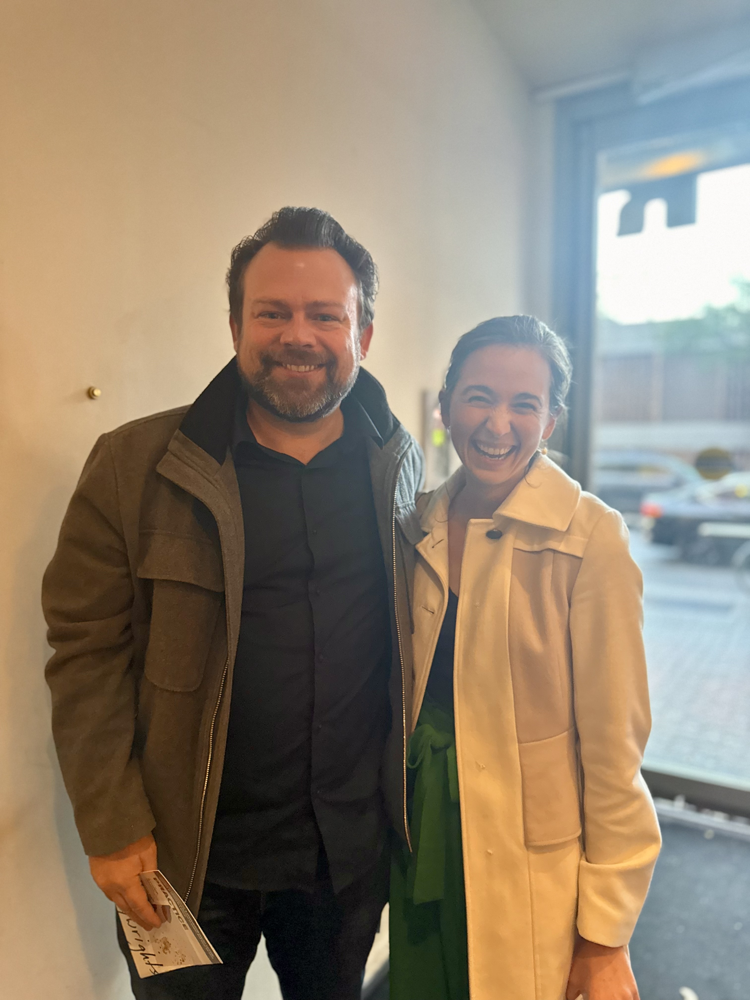
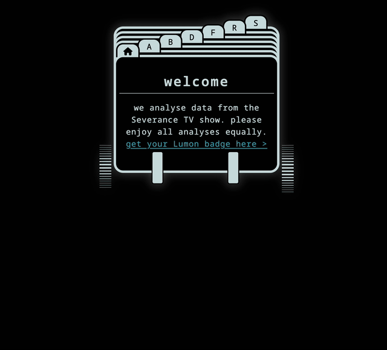

::: columns

::: column

First, and most importantly, here I am hanging with Dan Erickson, creator of *Severance*, after Jen's amazing one woman show. If only I had thought to ask him to take me on as the show's statistician, I think I would really thrive in this role!!

::: 

::: column



:::

::::

## Context, Please

I am a huge fan of the show [Severance](https://tv.apple.com/us/show/severance/). As I mention in the episode, I just *love* the amazing attention to detail throughout, it is such a fun show to watch and rewatch as a fan! I started collecting data while watching the show during its first season which resulted in an R package, [mdr](https://lucymcgowan.github.io/mdr/), as well as an elaborate fan site where I host lots of silly little analyses.

[](https://mdr.lucymcgowan.com)

For today, I am going to walk through an in depth analysis on whether Seth Milchick actually uses "too many big words" as he was told during a performance review in Season 2.

## Behind the Scenes

This analysis was made possible by the [mdr](https://lucymcgowan.github.io/mdr/) R package, which uses transcripts originally compiled by [the Severance wiki](https://severance.wiki/).

## Analysis

Below is a word cloud of Seth Milchick's most frequently used words of the past \[*few*\] quarter\[*s*\] alone. \[*Lumon*\] recommended that Mr. Milchick begin simplifying his language so as to achieve clearer comprehension from his subordinates and peers.

Lumon claimed (as detailed above) that Milchick is using too many big words. *I don't see evidence of this!*


```{r}
#| code-fold: false
#| message: false
#| warning: false
#| fig-align: center
library(mdr)
library(tidytext)
library(tidyverse)
library(wordcloud2)
library(textclean)
library(ggiraph)
library(lexicon)

set.seed(266)

transcripts |> 
  filter(grepl("Mil", speaker)) |>
  mutate(
    dialogue = str_replace_all(dialogue, "’", "'"),
    dialogue = replace_contraction(dialogue)
  ) |>
  unnest_tokens(word, dialogue) |>
  anti_join(stop_words, by = "word") |>
  filter(!word %in% c("ms", "miss", "b's"), !str_detect(word, "\\d")) |>
  mutate(word = gsub("'s", "", word)) |>
  count(word) |>
  filter(n > 2) |>
  arrange(desc(n)) |>
  wordcloud2(backgroundColor = "#030303",
             fontFamily = "Noto Sans Mono",
             size = 0.8)
```


Hmm, I'm not seeing that many big words! Maybe we should remove proper names.


```{r}
#| code-fold: false
#| fig-align: center
#| message: false
#| warning: false
transcripts |> 
  filter(grepl("Mil", speaker)) |>
  mutate(
    dialogue = str_replace_all(dialogue, "’", "'"),
    dialogue = replace_contraction(dialogue)
  ) |>
  unnest_tokens(word, dialogue) |>
  anti_join(stop_words, by = "word") |>
  mutate(word = gsub("'s", "", word)) |>
    filter(!word %in% c("ms", "miss", "b", 
                      "cobel", "mark", "dylan", "helly", "irving",
                      "bailiff", "casey", "dr", "eagan", "gretchen",
                      "harmony", "huang", "irv", "kier", "lawrence",
                      "milchick", "petey", "rwanda", "siena", "burt", "lumon", "scout", "mdr", "dieter", "seth"),
         !str_detect(word, "\\d")) |>
  count(word) |>
  filter(n > 1) |>
  arrange(desc(n)) |>
  wordcloud2(backgroundColor = "#030303",
             fontFamily = "Noto Sans Mono",
             size = 0.6)
```


Here's the thing, I don't think there are that many big words! We are of course making some assumptions here (mainly that the words we see in the on screen dialogue are representative of how he speaks off screen), but I think this is reasonable. Ok, maybe the word cloud is not the best way to see this (although we are just doing the same analysis Lumon claims to!), let's instead compare the percentage of multisyllabic words Milchick uses compared to the rest of the characters.

### Syllable count

Let's see if Milchick is really using more syllables than everyone else.


```{r}
#| fig-align: center
#| code-fold: true
#| message: false
#| warning: false
#| fig-width: 10

syllable_df <- transcripts |>
  mutate(
    dialogue = str_replace_all(dialogue, "’", "'"),
    dialogue = replace_contraction(dialogue),
    milchick = grepl("Mil", speaker)
  ) |>
  unnest_tokens(word, dialogue) 

safe_syllable_count <- possibly(
  function(x) qdap::syllable_count(x)$syllables, 
  otherwise = NA_real_
)

syllable_df$syllables <- map_dbl(syllable_df$word, safe_syllable_count)

means_df <- syllable_df |>
  filter(!is.na(syllables), syllables != 0) |>
  group_by(milchick) |>
  summarise(mean_syllables = mean(syllables),
            se_syllables = sd(syllables) / sqrt(n()),
            lcl = mean_syllables - 1.96 * se_syllables,
            ucl = mean_syllables + 1.96 * se_syllables)

p <- syllable_df |>
  filter(!is.na(syllables), syllables != 0) |>
  group_by(milchick, syllables) |>
  summarise(count = n(), .groups = "drop") |>
  group_by(milchick) |>
  mutate(percent = count/sum(count) * 100) |> 
  ggplot(aes(x = syllables, y = percent, fill = milchick,
             tooltip = glue::glue("{round(percent, 1)}% of the words spoken by {ifelse(milchick, 'Milchick','everyone else')} had {syllables} {ifelse(syllables !=1, 'syllables', 'syllable')}")))+
  geom_col_interactive(position = "dodge") +
  scale_fill_manual(values = c("TRUE" = "#E84646", "FALSE" = "#3C8DAD"),
                    name = "",
                    labels = c("Everyone Else", "Milchick")) +
  scale_color_manual(values = c("TRUE" = "red", "FALSE" = "blue")) +
  labs(
    x = "Syllable Count",
    y = "Percentage of Words",
  ) +
  theme_mdr() +
  scale_x_continuous(breaks = seq(0, 6, 1),
                     minor_breaks = seq(0, 6, 0.5)) +
  theme(
    legend.position = "bottom"
  )
#girafe(ggobj = p)
p
```


Looking at the distribution above, it looks like no, in general Milchick is in line with the other speakers. Milchick uses an average of `r means_df |> filter(milchick == TRUE) |> pull(mean_syllables) |> round(2)` (95% CI: `r means_df |> filter(milchick == TRUE) |> pull(lcl) |> round(2)` - `r means_df |> filter(milchick == TRUE) |> pull(ucl) |> round(2)`) syllables per word, whereas everyone else is close behind with an average of `r means_df |> filter(milchick == FALSE) |> pull(mean_syllables) |> round(2)` (95% CI: `r means_df |> filter(milchick == FALSE) |> pull(lcl) |> round(2)` - `r means_df |> filter(milchick == FALSE) |> pull(ucl) |> round(2)`). While this difference is technically statistically significant, we do not think it is scientifically meaningful.


### Common words

Ok, maybe by "big" Lumon meant not that the words were multisyllabic but rather uncommon. We can use Fry's 1000 word list (Fry (1997)) to help us see if Milchick uses uncommon words more frequently than the other characters. This list claims to contain words that make up 90% of all printed text, let's see if Milchick is using more uncommon words than his counterparts. 

```{r}
#| code-fold: false
#| fig-align: center
#| message: false
#| warning: false

words_df <- transcripts |>
  mutate(
    dialogue = str_replace_all(dialogue, "’", "'"),
    dialogue = replace_contraction(dialogue),
    milchick = grepl("Mil", speaker)
  ) |>
  unnest_tokens(word, dialogue) 

fry_words <- tibble(word = tolower(sw_fry_1000)) |>
  mutate(is_common = 1) |>
  distinct()

words_summary <- words_df |>
  left_join(fry_words, by = "word") |>
  mutate(is_common = if_else(is.na(is_common), 0, 1)) |>
  group_by(milchick) |>
  summarize(
    total_words = n(),
    common_words = sum(is_common),
    p_common = common_words / total_words,
    se = sqrt(p_common * (1 - p_common) / n()),
    pct_common = p_common * 100,
    lcl = (p_common - 1.96 * se) * 100,
    ucl = (p_common + 1.96 * se) * 100
  )

ggplot(words_summary, 
       aes(x = milchick, y = pct_common, fill = milchick)) +
  geom_col() +
  scale_fill_manual(values = c("TRUE" = "#E84646", "FALSE" = "#3C8DAD")) +
  scale_y_continuous("Percentage of Common Words", limits = c(0, 100)) +
  scale_x_discrete("", labels = c("Everyone else", "Milchick")) +
  theme_mdr() + 
  theme(legend.position = "none")
```


Well look at that, Milchick is in line with the rest of the characters! `r words_summary |> filter(milchick == TRUE) |> pull(pct_common) |> round(1)`% of Milchick's words are "common" (95% CI: `r words_summary |> filter(milchick == TRUE) |> pull(lcl) |> round(1)` - `r words_summary |> filter(milchick == TRUE) |> pull(ucl) |> round(1)`) compared to `r words_summary |> filter(milchick == FALSE) |> pull(pct_common) |> round(1)`% for everyone else `r words_summary |> filter(milchick == FALSE) |> pull(lcl) |> round(1)` - `r words_summary |> filter(milchick == FALSE) |> pull(ucl) |> round(1)`). Notably, these are both much lower than 90%, as (according to Fry) would be expected in written text, so maybe everyone is using weird vocabulary, but it is not at all unique to Milchick! We will be taking this up with the board.

*This analysis was made possible by the [mdr](https://lucymcgowan.github.io/mdr) R package, which used data originally compiled by [the Severance wiki](https://severance.wiki/). It uses data through season 2 episode 5.*

### Addendum

Some folks want to see which words are specific to Milchick -- instead of weighting by frequency like in our top word cloud, we could instead weight by the `tf-idf` (term frequency, inverse document frequency). This basically tells us *which* words are uniquely used by Milchick. I would argue this is *not* what Lumon claimed to do as they were trying to say he was using *too many* big words (which implies frequency), but in any case this is fun!


```{r}
#| code-fold: false
#| message: false
#| warning: false

tf_idf <- words_df |>
  mutate(word = case_when(
    word == "innie's" ~ "innie",
    .default = word
  )) |>
  filter(!str_detect(word, "\\d"), word != "b's") |>
  anti_join(stop_words, by = "word") |>
  count(milchick, word, sort = TRUE) |>
  bind_tf_idf(word, milchick, n) |>
  filter(milchick) |>
  mutate(n = round(tf_idf * 10000, 1)) |>
  select(word, n) |>
  arrange(desc(n)) 

wordcloud2(tf_idf, 
           backgroundColor = "#030303",
           fontFamily = "Noto Sans Mono",
           size = 0.2)
```


### Zipf Frequency

Our refiner of the quarter, [Leopold](https://github.com/LeopoldTal), pointed out that we could use the `Zipf frequency` of the words to get a more granular look at whether Milchick is using common language (compared to our Fry approach which just dichotomized as common/not common). As the title of my main blog, [livefreeordichotomize](https://livefreeordichotomize.com), would suggest, I am ALWAYS here to avoid dichotomizing. The `Zipf frequency` is the log (base 10) of the number of times a word appears per billion words (i.e., a word with `Zipf frequency` of 3 appears once per million words). Ok, let's try that! We've calculated this for our main guy, Milchick, along with some other characters to compare him to and plotted the density. The dashed lines represent the medians.


```{r}
#| code-fold: false
#| message: false
#| warning: false

library(reticulate)
words_df <- transcripts |> 
  mutate(
    dialogue = str_replace_all(dialogue, "’", "'"),
    dialogue = replace_contraction(dialogue),
    character = case_when(
      grepl("Mil", speaker) ~ "Milchick",
      grepl("Cob", speaker) ~ "Cobel",
      grepl("Mark", speaker) ~ "Mark",
      grepl("Hel", speaker) ~ "Helly/Helena",
      grepl("Irv", speaker) ~ "Irving",
      grepl("Huang", speaker) ~ "Ms. Huang",
      grepl("Dylan", speaker) ~ "Dylan",
      .default = "Everyone else"
    )
  ) |>
  unnest_tokens(word, dialogue) |>
  anti_join(stop_words, by = "word") |>
  mutate(word = gsub("'s", "", word))
```

```{python}
#| code-fold: false
#| message: false
#| warning: false
from wordfreq import zipf_frequency

df = r.words_df
zipf = df['word'].apply(lambda word: zipf_frequency(word, 'en'))
r.zipf = zipf.tolist()
```

```{r}
#| code-fold: false
#| fig-align: center
#| fig-width: 10
#| message: false
#| warning: false

words_df$zipf <- as.numeric(zipf)

words_df <- words_df |>
  filter(zipf > 0)

zipf_medians <- words_df |>
  group_by(character) |>
  summarize(median_zipf = median(zipf))

ggplot(words_df, aes(x = zipf, fill = character)) +
  geom_density(alpha = 0.5) +
  geom_vline(data = zipf_medians, 
             aes(xintercept = median_zipf,
                 color = character), 
             linetype = "dashed") +
  geom_label(data = zipf_medians, aes(label = glue::glue("Median: {round(median_zipf,1)}"),
                                      x = 2, y = 0.5),
             inherit.aes = FALSE) +
  facet_wrap(~character) +
  labs(
    x = "Zipf frequency (log10 occurances per a billion words)",
    y = "Density"
  ) +
  theme_mdr() + 
  theme(legend.position = "none")
```


Fascinating, this is a great view of the language! Of the ones we examined, most of our main characters have a median Zipf frequency between `r zipf_medians |> filter(character == "Cobel") |> pull(median_zipf) |> round(1)` (Cobel) and `r zipf_medians |> filter(character == "Ms. Huang") |> pull(median_zipf) |> round(1)` (Ms. Huang), with the exception of Milchick (`r zipf_medians |> filter(character == "Milchick") |> pull(median_zipf) |> round(1)`) and Irving (`r zipf_medians |> filter(character == "Irving") |> pull(median_zipf) |> round(1)`). Now, one angle is that Milchick is using too big of words, but another is that Ms. Huang, his likely accuser, is just using too basic of words compared to the others. Or maybe she is onto something, his Zipf frequency distribution is (statistically) significantly different from everyone else (p = `r scales::pvalue_format()(ks.test(words_df$zipf[words_df$character == "Milchick"], words_df$zipf[words_df$character != "Milchick"])$p.value)`).


```{r}
#| echo: false
#| eval: false

ks.test(words_df$zipf[words_df$character == "Ms. Huang"], words_df$zipf[words_df$character != "Ms. Huang"])$p.value
ks.test(words_df$zipf[words_df$character == "Milchick"], words_df$zipf[words_df$character != "Milchick"])
ks.test(words_df$zipf[words_df$character == "Milchick"], words_df$zipf[words_df$character == "Cobel"])
```


