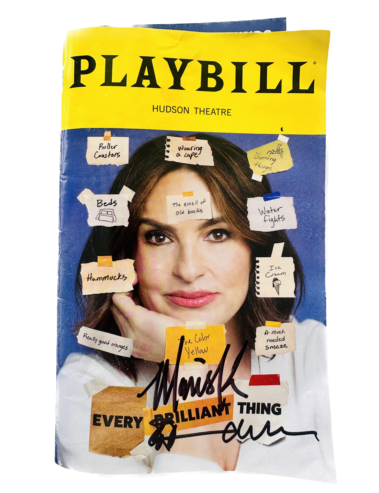

## Context, Please

[_Law & Order_](https://en.wikipedia.org/wiki/Law_%26_Order) is a TV show that has been on the air since 1990. (It originally aired from 1990 to 2010, then was revived in 2022.) Its basic formula is summarized neatly by the [opening narration](https://www.youtube.com/watch?v=lMalvNeJFLk), which is followed by a famous DUN-DUN sound: “In the criminal justice system, the people are represented by two separate, yet equally important, groups: the police, who investigate crime; and the district attorneys, who prosecute the offenders. These are their stories.”

As an avid watcher of the show and its spinoffs, especially _Law & Order: Special Victims Unit_, I have long wondered: How long does it actually take in Law & Order land for the criminal justice system to work, compared with how long it takes in reality?

I started a newsletter called [Wrong Number](https://wrongnumber.beehiiv.com/) with two friends, Caitlin Gilbert and John Harden, to nerd out on data fixations like this one! More details about how I got the data and did the analysis are in [my first post](https://wrongnumber.beehiiv.com/p/the-speed-of-justice-according-to-law-order), which this one is adapted from. While you’re there, check out Caitlin’s [post about theme park accidents](https://wrongnumber.beehiiv.com/p/the-dark-side-of-orlando-theme-parks) and John’s about [the kinds of trees that are found in each city](https://wrongnumber.beehiiv.com/p/your-neighborhood-is-probably-getting-gen-tree-fied).

## Behind the Scenes

_Law & Order_ has episode scene cards that demarcate major scene changes. A scene card has the date and address where the scene is supposed to be taking place. The intrepid fans on the show’s Fandom Wiki have diligently jotted down the contents of the episode scene cards for a vast majority of episodes. I [compiled the available episode scene card data](https://docs.google.com/spreadsheets/d/1Kx3jrh44nrAW4jhUkGhZAOQrtEzCqaCL_u3YwtJEWDI/edit?gid=11850358#gid=11850358) from every episode of _Law & Order_ (this goes through Season 25, Episode 12).

I calculated the time between the first scene card and the final scene card to determine the length of time elapsed over the course of the episode.

Separately, I cross-referenced my information using a [spreadsheet I came across](https://www.thecomicboard.com/threads/law-order-timeline.14797/) on The Comic Board discussion forum: A fan had used the scene cards as guideposts, but also looked at the outfits the characters were wearing from scene to scene to determine whether that scene took place the same day as the preceding one, as well as using dialogue clues.

## Analysis

Here’s a histogram showing the distribution of the time elapsed in each episode. The average _Law & Order_ episode takes place over the course of about **68 days**. How does that compare with reality? 

According to a 2024 [report](https://comptroller.nyc.gov/reports/ensuring-timely-trials/) commissioned by the New York City Comptroller: “Since 2019, the average time to process a murder case has risen by 37%, by an average of 221 days, from just over nineteen months to **almost 27 months**.” 27 months = **821 days**. 

So, justice in _Law & Order_ land happens about 13 times as fast as it does in reality. If anything, this is an understimate of how quickly justice is served on the show vs. in real life, because the report measures the amount of time from the initial arrest to the resolution of the trial. An episode of L&O, by contrast, typically begins when the crime is committed. So, if anything, _Law & Order_ should take longer than it does in reality, because the police take time to investigate the crime and identify the suspect.

I also made a Gantt chart to display the timeline of cases, to see cases that are effectively overlapping — e.g., detectives closing one case while in the midst of another. Here it is for L&O season 1, organized by episode air date.

Interestingly, the same chart for season 24 of _Law & Order: Special Victims Unit_ shows cases that do not overlap at all and that take much less time than the ones in _Law & Order_ season 1: an average of just **5.3 days**. Why is this the case? Sex crimes, I would imagine, take even longer to investigate and prosecute in real life than murder or other kinds of felonies, if they even make it to trial. It could be that the writers’ rooms for these shows have gotten more self-aware about the dates they put on the episode scene cards, and there is some desire to reduce overlapping dates within a season (though, in my opinion, having overlapping dates would be more true to reality, not less).

You can find more analyses as well as the code I used to make these plots in [my newsletter post](https://wrongnumber.beehiiv.com/p/the-speed-of-justice-according-to-law-order)!

## Conclusion

In the fictional universe of _Law & Order_, justice is served swiftly and effectively, more so than in the real-life statistics on the criminal justice system.

## Sidenotes

I am not a legal expert, and I could be off in my collection of the data, or my interpretation of the stats. If you have additional thoughts on this, please get in touch! You can email my newsletter at wrongnumbernewsletter @ gmail.com.

And finally, this summer (after the airing of the podcast episode) I went to see Mariska Hargitay, aka SVU Captain Olivia Benson in [Every Brilliant Thing](https://everybrilliantthing.com/) on Broadway. I was lucky enough to catch her last show, which also featured her husband, Peter Hermann (aka the recurring defense attroney Trevor Langan). Sadly I did not share the reuslts of my analysis with them, but they were nice enough to sign my Playbill.

