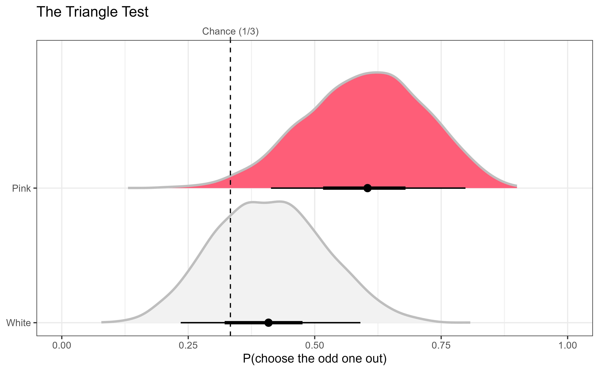
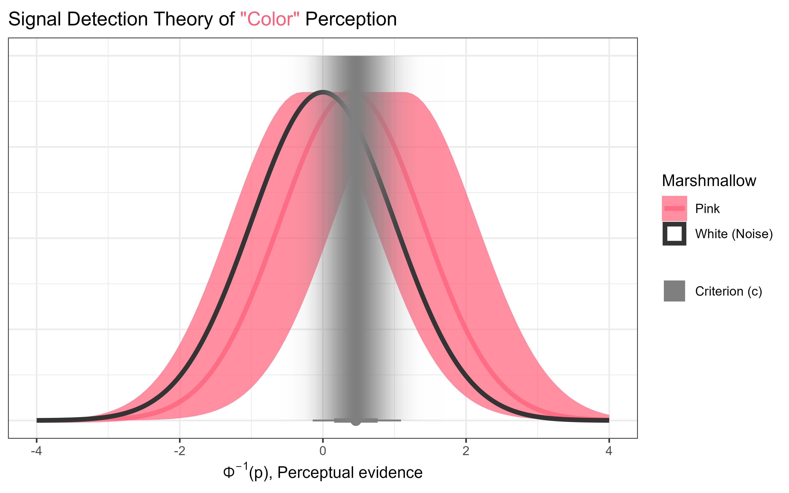

## Context, Please

No debate in Israel is quite as heated as the one over the differences between white and pink marshmallows.

While some argue that white marshmallows taste the best,
others sneer and laugh at that notion -- _of course_ the pink marshmallows are far superior!
And yet, there is a third group, equally mocked by the white- and pink-lovers:
those that claim no difference between the two colors at all!

Sounds like an empirical question to me! Let's go answer it!

> Is there a perceptible difference between white and pink marshmallows?

## Behind the Scenes

24 unassuming undergrad students in [the Statistics and Data Analysis program at Ben-Gurion University](https://www.bgu.ac.il/u/faculties/interdisciplinary/schools/statistics-data-analysis/)
and graduate students from [the Psychology Department at Ben-Gurion University](https://www.bgu.ac.il/en/u/faculties/humanities-and-social-sciences/departments/psychology/) and [the Psychology School at Tel Aviv University](https://en-social-sciences.tau.ac.il/psy)
volunteered to eat some marshmallows.
(Two additional data points were collected from me and my wife, Naama.)

The experiment had two parts: the triangle test and the identification test --
a modern take on [the lady tasting tea experiment](https://en.wikipedia.org/wiki/Lady_tasting_tea).

In the triangle test, 3 marshmallows were placed in front of blindfolded participants:
two were of the same color, and one was of a different color, with the order and colors randomly determined.
Students were instructed to try and guess which was the odd-one-out. They were free to eat, taste, nibble, smell and do whatever they wanted.

After completing the triangle test, they were handed a fourth marshmallow (still blindfolded) for the identification test. The color of this marshmallow was also randomly determined.

## Analysis

The analysis uses the amazing [`brms`](https://paulbuerkner.com/brms) package,
the superb [`marginaleffects`](https://marginaleffects.com) package for post-estimation processing,
and the glorious [`ggdist`](https://mjskay.github.io/ggdist) for visualizing posterior distributions and uncertainty.

### The Triangle Test

For the triangle test, a simple Bayesian logistic regression analysis was used to predict the probability of correctly identifying the odd-one-out.
If there is a noticeable difference, we would expect this probability to be higher than chance - in this case 1/3.
The color of the odd-one-out was also included to explore the possibility that it is easier/harder to detect an odd _pink_ marshmallow than an odd _white_ marshmallow.

So, Can people correctly identify the ***odd-colored marshmallow*** in a blind taste test?

It seems like people can - performing above chance (1/3), with a 90% HDI [0.36, 0.65], _pd_=97.35%!
However, they seem to be better at doing this when the odd one out is pink than when it's white...

### The Identification Test

An additional Bayesian binomial model with a probit link was used,
predicting participants' responses from the actual color of the marshmallow.
[It can be shown](https://doi.org/10.1037/1082-989X.3.2.186) that such a model can be used to estimate the _Signal Detection Theory_ parameters, with the slope for the indicator variable being equal to $d'$ and the intercept ($\times -1$) being equal to the criterion $c$.

So can people reliably *identify* the **pink marshmallow** from the **white marshmallow**?

Using Signal Detection Theory (SDT), *discriminability* is captured by _d_-prime,
and is conceptualized as the distance of the distribution of perceptual
evidence for the **pink marshmallow** (**Signal+Noise**) from the distribution
of perceptual evidence for the **white marshmallow** (**Noise** fixed at $N(0, 1)$).
Here there was an 82.33% posterior probability that discriminability is greater than 0,
but there was also a posterior probability of 27.5% that discriminability is less than 0.15... So pretty inconclusive.

But a true Bayesian embraces uncertainty!

### _Addendum_

Following the recording of the episode, I received an official response from a food scientist on behalf of the marshmallow company:

> There are no differences in the ingredients besides the colors, and the pink marshmallow contains strawberry extract.

---

*The data and code behind this post can be found [here](https://github.com/mattansb/Regression-to-the-Marshmallow-Girls/tree/main).*
